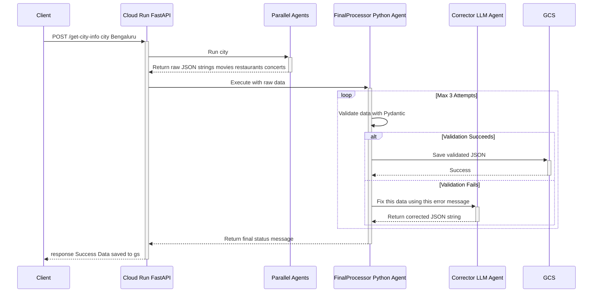

# MetroPulse AI: Real-Time Location Information Agent

MetroPulse AI is a sophisticated, cloud-native agentic workflow built with the Google Agent Development Kit (ADK). Given a location name, it concurrently fetches real-time information on movie showtimes, restaurants, and concerts (for now), validates the data, and archives it in Google Cloud Storage.

This project serves as a powerful demonstration of building resilient, production-ready AI systems that can handle the inconsistencies of real-world data and perform creative inference tasks.

## Key Features

-   **Adaptable Location-Based Search:** The API endpoint is generalized to handle any `location`, allowing for both high-level searches (e.g., "Bengaluru") and hyperlocal queries (e.g., "Koramangala, Bengaluru").
-   **Creative AI Inference:** The movie agent goes beyond data retrieval to infer and suggest a list of Myers-Briggs Type Indicator (MBTI) personality types that would likely enjoy a film, adding a layer of personalized insight.
-   **Concurrent Data Fetching:** Utilizes a `ParallelAgent` to gather information for all categories simultaneously, ensuring rapid response times.
-   **Robust Python-First Data Validation:** Leverages Pydantic schemas for strict, deterministic validation of data structures and types *before* storage, guaranteeing data integrity.
-   **Intelligent Self-Healing Capability:** Implements a fallback "Corrector Agent" within a retry loop. If the initial data from an agent fails validation, a powerful LLM is invoked specifically to fix the data based on the precise validation error, making the pipeline resilient to LLM inconsistencies.
-   **Cloud-Native & Serverless:** Packaged as a Docker container and deployed on Google Cloud Run, providing a scalable, secure, and cost-effective FastAPI endpoint with CORS enabled for web frontends.
-   **Pure Python Final Processing:** A custom `BaseAgent` handles all final validation, data cleaning, and storage logic in deterministic Python, using LLMs only when necessary for specialized tasks.
-   **User Submitted Reports:** A custom sequence agent which will handle user submitted reports and formulates a clean, insightful, well defined summary.
## System Architecture

The application follows a sequential pipeline that orchestrates a parallel data-gathering step followed by a robust, custom processing step.



## Project Structure

```
metro_ai/
├── agents/
│   ├── common_tools/
│   │   ├── __init__.py
│   │   ├── schemas.py          # Central Pydantic models for data validation.
│   │   └── data_handler.py     #  custom tool tos ave artifact in gcs.
│   ├── concert_agent/
│   │   └── agent.py            # Simple LLM agent to fetch concert data.
│   ├── movie_agent/
│   │   └── agent.py            # Simple LLM agent to fetch movie data.
│   ├── restaurant_agent/
│   │   └── agent.py            # Simple LLM agent to fetch restaurant data.
│   ├── corrector_agent.py         # The specialist LLM agent for self-healing.
│   ├── final_processor_agent.py # The custom Python agent for validation and storage.
│   └── orchestrator_agent/
│       └── agent.py            # Defines the master SequentialAgent pipeline.
├── .env                        # Local environment variables (DO NOT COMMIT).
├── .gcloudignore               # Files to ignore during gcloud deployment.
├── .dockerignore               # Files to ignore during Docker build (IMPORTANT for security).
├── Dockerfile                  # Instructions for building the container image.
├── main.py                     # The FastAPI server application.
├── requirements.txt            # Project dependencies.
├── setup_gcp.sh                # One-time script to configure GCP project permissions.
└── deploy.sh                   # Script to build and deploy the application to Cloud Run.
```

## Google Cloud Setup (One-Time)

Before deploying, you need to configure your Google Cloud project.

1.  **Enable APIs:** Ensure the following APIs are enabled in your GCP project:
    -   Cloud Run API
    -   Vertex AI API
    -   Cloud Storage API

2.  **Create a GCS Bucket:** Create a new Google Cloud Storage bucket to store the output artifacts.

3.  **Configure `.env` file:** Create a `.env` file in the root of the project with your specific configuration:
    ```env
    # Vertex backend config
    GOOGLE_GENAI_USE_VERTEXAI=TRUE
    GOOGLE_CLOUD_LOCATION=us-central1
    GOOGLE_CLOUD_STAGING_BUCKET=gs://your-bucket-name-here
    GOOGLE_CLOUD_PROJECT=your-gcp-project-id-here

    # Optional: If you have GOOGLE_APPLICATION_CREDENTIALS set for local dev, it will be used.
    ```

4.  **Run the Setup Script:** Make the script executable and run it once to grant the necessary IAM permissions to the Cloud Run service account.
    ```bash
    chmod +x setup_gcp.sh
    ./setup_gcp.sh
    ```

## Local Development & Setup

1.  **Clone the repository:**
    ```bash
    git clone <your-repo-url>
    cd metro_ai
    ```
2.  **Create a Python virtual environment:**
    ```bash
    python -m venv .venv
    source .venv/bin/activate
    ```
3.  **Install dependencies:**
    ```bash
    pip install -r requirements.txt
    ```
4.  **Authenticate gcloud (for local runs):**
    ```bash
    gcloud auth application-default login
    ```
5.  **Run the FastAPI server locally:**
    ```bash
    uvicorn main:app --reload
    ```    The server will be available at `http://127.0.0.1:8000`.

## Deployment to Google Cloud Run

The entire deployment process is automated with a single script.

1.  **Ensure your `.env` file is correct.** The script reads from this file to configure the deployment.
2.  **Make the script executable:**
    ```bash
    chmod +x deploy.sh
    ```
3.  **Run the deployment:**
    ```bash
    ./deploy.sh
    ```
    The script will build the container image using Cloud Build and deploy it to a new service on Cloud Run. It will output the final service URL upon completion.

## API Usage

You can interact with the deployed API using any HTTP client.

### Sample Request (`curl`)

Replace `<your-service-url>` with the URL provided after deployment.

```bash
curl -X POST "https://<your-service-url>.a.run.app/get-location-info" \
-H "Content-Type: application/json" \
-d '{"location": "Bengaluru"}'


```

### Sample Success Response

```json
{
  "location": "Bengaluru",
  "movies": [
    {
      "name": "The Fantastic Four: First Steps",
      "genre": "Action, Sci-Fi, Adventure",
      "compatible_mbti": ["ENTP", "INTP", "INTJ", "ESTP"],
      "language": "English",
      "certificate": "UA13+",
      "description": "A new take on the classic Marvel superhero team, exploring their origins and first adventures.",
      "locations_available": {
        "Innovative Multiplex Marathahalli": ["10:45 AM"]
      }
    },
    {
      "name": "Jurassic World Rebirth",
      "genre": "Action, Adventure, Sci-Fi",
      "compatible_mbti": ["ESTP", "ISTP", "ENTP", "INTP"],
      "language": "English",
      "certificate": "Not specified",
      "description": "Dinosaurs are back and more dangerous than ever in this new installment of the Jurassic World saga.",
      "locations_available": {
        "BookMyShow": ["Check Listings"]
      }
    },
    {
      "name": "Superman",
      "genre": "Action, Adventure, Sci-Fi",
      "compatible_mbti": ["INFJ", "ENFJ", "ISTJ", "ESTJ"],
      "language": "English",
      "certificate": "Not specified",
      "description": "The classic hero returns to save the day in this action-packed adventure.",
      "locations_available": {
        "BookMyShow": ["Check Listings"]
      }
    },
    {
      "name": "Nilgiris: A Shared Wilderness",
      "genre": "Documentary",
      "compatible_mbti": ["INFP", "INFJ", "ISFP", "ISTP"],
      "language": "English",
      "certificate": "Not specified",
      "description": "A look into the rich biodiversity and wildlife of the Nilgiri Biosphere Reserve.",
      "locations_available": {
        "BookMyShow": ["Check Listings"]
      }
    },
    {
      "name": "F1: The Movie",
      "genre": "Action, Sports",
      "compatible_mbti": ["ESTP", "ISTP", "ENTJ", "ESTJ"],
      "language": "English",
      "certificate": "Not specified",
      "description": "Experience the thrill and adrenaline of Formula 1 racing.",
      "locations_available": {
        "BookMyShow": ["Check Listings"]
      }
    },
    {
      "name": "Saiyaara",
      "genre": "Drama, Romance, Musical",
      "compatible_mbti": ["INFP", "ISFP", "ENFP", "ESFP"],
      "language": "Hindi",
      "certificate": "UA16+",
      "description": "A romantic musical drama exploring love and relationships.",
      "locations_available": {
        "Innovative Multiplex Marathahalli": ["01:00 PM"],
        "Sandhya Theatre RGB Laser Atmos": ["Check Listings"]
      }
    },
    {
      "name": "Hari Hara Veera Mallu: Part 1 – Sword Vs Spirit",
      "genre": "Action, Adventure, Thriller",
      "compatible_mbti": ["ESTP", "ISTP", "ENTJ", "INTJ"],
      "language": "Telugu, Hindi",
      "certificate": "UA16+",
      "description": "A historical action epic filled with thrilling adventures and sword fights.",
      "locations_available": {
        "Innovative Multiplex Marathahalli": ["10:30 AM"],
        "Sandhya Theatre RGB Laser Atmos": ["Check Listings"]
      }
    },
    {
      "name": "Ekka",
      "genre": "Action",
      "compatible_mbti": ["ESTP", "ISTP", "ESTJ", "ISTJ"],
      "language": "Kannada",
      "certificate": "UA16+",
      "description": "An action-packed Kannada film.",
      "locations_available": {
        "Innovative Multiplex Marathahalli": ["Check Listings"],
        "Sandhya Theatre RGB Laser Atmos": ["Check Listings"]
      }
    },
    {
      "name": "Thalaivan Thalaivii",
      "genre": "Drama",
      "compatible_mbti": ["INFJ", "ENFJ", "ISFJ", "ESFJ"],
      "language": "Tamil",
      "certificate": "UA13+",
      "description": "A Tamil drama exploring complex relationships.",
      "locations_available": {
        "Innovative Multiplex Marathahalli": ["Check Listings"],
        "Sandhya Theatre RGB Laser Atmos": ["Check Listings"]
      }
    },
    {
      "name": "Su From So",
      "genre": "Comedy",
      "compatible_mbti": ["ESFP", "ISFP", "ENFP", "INFP"],
      "language": "Kannada",
      "certificate": "UA16+",
      "description": "A Kannada comedy film.",
      "locations_available": {
        "Innovative Multiplex Marathahalli": ["12:40 PM"],
        "Sandhya Theatre RGB Laser Atmos": ["Check Listings"]
      }
    }
  ],
  "restaurants": {
    "veg_restaurants": [
      {
        "name": "Vidyarthi Bhavan",
        "cuisine": "South Indian",
        "rating": 4.5,
        "address": "Basavanagudi, Bengaluru [9]"
      },
      {
        "name": "Brahmins' Coffee Bar",
        "cuisine": "South Indian",
        "rating": 4.4,
        "address": "Shankarpuram, Bengaluru [9, 11]"
      },
      {
        "name": "Mavalli Tiffin Room (MTR)",
        "cuisine": "South Indian",
        "rating": 4.3,
        "address": "Lalbagh, Bengaluru [10, 11]"
      },
      {
        "name": "Green Theory",
        "cuisine": "Global Vegetarian",
        "rating": 4.0,
        "address": "Richmond Road, Bengaluru [4]"
      },
      {
        "name": "Little Italy",
        "cuisine": "Italian",
        "rating": 4.2,
        "address": "Indiranagar, Bengaluru [4, 11]"
      }
    ],
    "nonveg_restaurants": [
      {
        "name": "Meghana Foods",
        "cuisine": "Andhra, Biryani, North Indian, Seafood",
        "rating": 4.0,
        "address": "Jayanagar, Bengaluru [3, 5]"
      },
      {
        "name": "Empire Restaurant",
        "cuisine": "North Indian, Biryani, Kebab, South Indian, Mughlai, Chinese, Seafood",
        "rating": 3.8,
        "address": "Majestic, Gandhi Nagar, Bengaluru [3, 5]"
      },
      {
        "name": "Nagarjuna Restaurant",
        "cuisine": "Andhra",
        "rating": 4.1,
        "address": "Residency Road, Bengaluru [2, 3, 8]"
      },
      {
        "name": "AB's - Absolute Barbecues",
        "cuisine": "Barbecue, North Indian, Kebab, Biryani",
        "rating": 4.2,
        "address": "BTM Layout, Bengaluru [5]"
      },
      {
        "name": "Shivaji Military Hotel",
        "cuisine": "Non-Vegetarian",
        "rating": 4.0,
        "address": "Jayanagar, Bengaluru [2, 8]"
      }
    ]
  },
  "concerts": [
    {
      "name": "Rajesh Krishnan Live in Concert",
      "date": "2025-07-26",
      "venue": "Orion Mall, Rajajinagar",
      "description": "A soulful celebration of Kannada music's golden voice, wrapped in nostalgia, rhythm, and timeless emotion. Expect an immersive live experience as Rajesh Krishnan brings his iconic hits to life from heart-melting ballads to festive chartbusters [3, 8]."
    },
    {
      "name": "Indo Tech ft. Akhlad Ahmed",
      "date": "2025-07-27",
      "venue": "Kitty Ko the Lalit Ashok",
      "description": "Details about the event are not available in the search results."
    },
    {
      "name": "Shallou",
      "date": "2025-08-03",
      "venue": "GYLT",
      "description": "Details about the event are not available in the search results [2, 6, 7]."
    },
    {
      "name": "KUMAR SANU LIVE IN CONCERT",
      "date": "2025-08-09",
      "venue": "Pheonix Market City, Whitefield",
      "description": "Details about the event are not available in the search results [3, 10]."
    },
    {
      "name": "KS Chitra Live Bengaluru (Chithra 45)",
      "date": "2025-08-16",
      "venue": "J K Grand Arena",
      "description": "A night of pure musical nostalgia as the legendary Dr. KS Chithra celebrates 45 glorious years in music [11]."
    },
    {
      "name": "Wonderla with Strangers",
      "date": "2025-08-23",
      "venue": "Bengaluru",
      "description": "Details about the event are not available in the search results [3]."
    },
    {
      "name": "Hiphop Tamizha",
      "date": "2025-08-23",
      "venue": "NICE Grounds",
      "description": "An explosive rap-folk fusion, performing biggest hits like Enjoy Enjaami, Theera Ulaa, and Vetri Kodi Kattu [11]."
    },
    {
      "name": "Dandiya Night Festival 2025",
      "date": "2025-09-28",
      "venue": "Manpho Convention Centre",
      "description": "Details about the event are not available in the search results [3]."
    },
    {
      "name": "Passenger",
      "date": "2025-11-22",
      "venue": "Phoenix Market City",
      "description": "Details about the event are not available in the search results [2, 6, 7]."
    },
    {
      "name": "Jacob Collier",
      "date": "2025-12-02",
      "venue": "Gymkhana Grounds (Indian Institute of Science)",
      "description": "Details about the event are not available in the search results [2, 6, 7]."
    }
  ]
}

```

### Sample Failure Response (after retries)

```json
{
  "response": "ERROR: Failed to validate data after 3 attempts. Final error: <Pydantic validation error details>"
}
```

---

## Current Limitations

-   **Data Source Dependency:** The system currently relies exclusively on Google Search as its tool. The quality and structure of the data are subject to the format of search results, which can be inconsistent or incomplete.
-   **Semantic Hallucination:** While the self-healing mechanism corrects syntactic and structural errors in the data, it does not prevent the LLM from potential semantic errors or "hallucinations" (e.g., inventing a movie showtime).
-   **No Caching:** Every API call, even for the same location, triggers a full agent run. This is inefficient for popular locations and can increase costs and latency.
-   **Stateless Sessions:** The use of `InMemorySessionService` is perfect for the stateless nature of Cloud Run but would not support conversational memory or follow-up questions in a different architecture.

## Future Scope

-   **Specialized Tools:** Develop dedicated Python tools for more reliable data gathering. This could include web scraping tools (using `BeautifulSoup` or `Playwright`) for specific ticket booking sites or direct integration with third-party APIs (e.g., weather APIs, event APIs).
-   **Enhanced Personalization:** Add a user context layer. The API could accept a user's MBTI type and re-rank or filter movie results based on compatibility.
-   **Implement a Caching Layer:** Integrate a caching solution like Redis or Google Cloud Memorystore to store results for popular locations for a short TTL (e.g., 1-2 hours). This would dramatically reduce latency and cost for frequent queries.
-   **Expand Agent Capabilities:** Add new agents to the parallel step to fetch more information, such as:
    -   `WeatherAgent`
    -   `LocalEventsAgent` (for festivals, workshops, etc.)
    -   `TrafficAgent`
-   **Authentication and Rate Limiting:** For a true production API, implement an authentication layer (e.g., API Keys) and rate limiting to prevent abuse.
-   **Asynchronous Processing:** For very long-running queries, the architecture could be shifted to an asynchronous model where the client submits a job and polls a status endpoint for the result.
