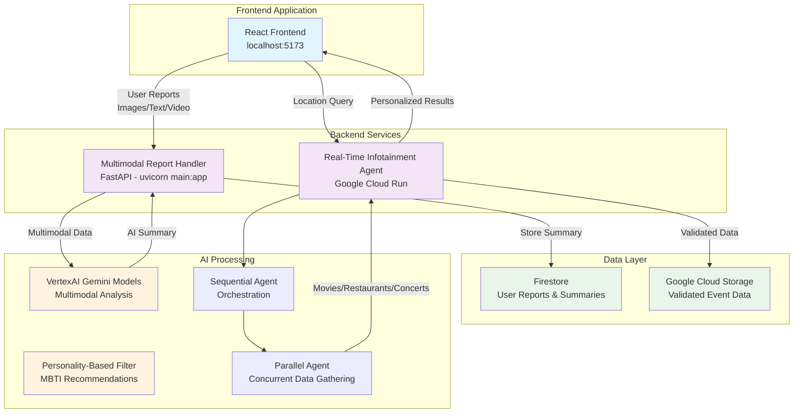
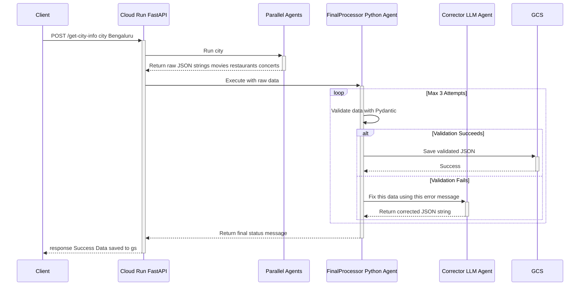

# MetroPulse: The Digital Pulse of Your City 🌆

**Team 200NotOk** | **Managing City Data Overload**

MetroPulse is not just a map or event aggregator—it's the digital pulse of your city, curated just for you. We transform the overwhelming noise of urban life into a serene, relevant, and joyful experience by filtering information through your unique personality and preferences.

## 🚀 The Problem We're Solving

We are drowning in a sea of digital noise:

- **Digital Overload**: Constant, irrelevant notifications from dozens of apps create anxiety and decision fatigue
- **Fear Of Missing Out (FOMO)**: Endless scrolling on event apps leads to analysis paralysis and never making the "perfect" choice  
- **Impersonal Recommendations**: Existing platforms maximize engagement and ad revenue, not personal well-being—they tell us what's popular, not what's right for us

The result is a generation that is more connected, yet feels more disconnected from their own communities and themselves.

## ✨ Our Solution

MetroPulse couples two powerful, independently scalable systems:

1. **Real-Time Infotainment Agent**: Fetches and structures planned events like movies, concerts, and restaurant openings for any location
2. **Multimodal Event Summarizer**: Captures and understands the unstructured, real-time pulse of the city—from traffic jams and water logging to pop-up book clubs and community gatherings

This data is filtered through our unique **Personality-Based Noise Filter** to create a serene, relevant, and joyful urban experience. We transform FOMO into **JOMO** (the Joy of Missing Out... on what doesn't matter to you).

## 🛠️ Google Technologies Used

- **Google Cloud Run** – Serverless, containerized microservices with auto-scaling
- **Firebase** – User authentication and city data storage  
- **VertexAI (Gemini Models)** – Creative inference, multimodal summarization, and intelligent data correction
- **Google Agent Development Kit** – Orchestrating complex workflows with SequentialAgent and ParallelAgent
- **Google Cloud Storage** – Archiving validated JSON data for analysis and improvements
- **Firebase Studio** – Cloud-based IDE for development
- **Google Maps** – Interactive city maps and location coordinates

## 🎯 Key Features

### What It Offers
- **Live City Feed on Map**: Interactive map-based dashboard exploring real-time events, incidents, and alerts
- **Multilingual Multimodal Event Reporting**: Users upload geotagged images, text, and videos—our AI analyzes and summarizes them
- **Personalized Pulse Experience**: AI-powered local recommendations based on personality, location, and interactions

### How It Works
- **Hyperlocal & City-Wide Granularity**: Understanding context from neighborhoods to metropolitan areas
- **Concurrent Agentic Data Pipelines**: Fast, efficient data gathering from multiple sources simultaneously  
- **Robust Self-Healing Data Pipeline**: Python-first validation with specialist LLM agents for error correction
- **Scalable Decoupled Microservices**: Independent development, deployment, and scaling of components

## 🌟 Impact

1. **Real-Time Public Awareness**: Unified, AI-driven city feed for traffic, civic issues, and local happenings
2. **Empowers Hyperlocal Business Engagement**: Insights into personality distribution for specific geolocations
3. **Reduces Information Overload**: AI-curated summaries and personality-based filtering for relevance

## 🏗️ System Architecture



## 🚀 Quick Start Guide

### 1. Frontend Setup
```bash
cd Frontend
npm install
npm run dev
# View on http://localhost:5173
```

### 2. Backend Setup (Multimodal Report Handler)
```bash
cd Backend/parallel_agent_setup
uvicorn main:app --reload
# Handles user-submitted reports and provides insightful summaries
# Data flows: Frontend → Backend → Firestore
```

### 3. Agent Setup (Real-Time Infotainment)
```bash
cd metro_ai
# Follow the detailed setup below
```

## 🏗️ Detailed Agent Architecture

The real-time infotainment system follows a sequential pipeline orchestrating parallel data-gathering with robust processing:



## 📁 Project Structure

```
MetroPulse/
├── Frontend/                           # React application
│   ├── src/
│   ├── package.json
│   └── ...
├── Backend/
│   └── parallel_agent_setup/          # Multimodal report handler
│       ├── main.py                     # FastAPI server
│       └── ...
└── metro_ai/                          # Real-time infotainment agent
    ├── agents/
    │   ├── common_tools/
    │   │   ├── schemas.py              # Pydantic validation models
    │   │   └── data_handler.py         # GCS storage tool
    │   ├── concert_agent/
    │   ├── movie_agent/
    │   ├── restaurant_agent/
    │   ├── corrector_agent.py          # Self-healing LLM agent
    │   ├── final_processor_agent.py    # Python validation & storage
    │   └── orchestrator_agent/
    ├── main.py                         # FastAPI server
    ├── requirements.txt
    ├── Dockerfile
    ├── setup_gcp.sh                    # GCP configuration script
    └── deploy.sh                       # Cloud Run deployment
```

## ⚙️ Google Cloud Setup (One-Time)

### Prerequisites
1. **Enable APIs**:
   - Cloud Run API
   - Vertex AI API  
   - Cloud Storage API

2. **Create GCS Bucket**: For storing validated event data

3. **Configure Environment**:
```env
# Create .env in metro_ai/
GOOGLE_GENAI_USE_VERTEXAI=TRUE
GOOGLE_CLOUD_LOCATION=us-central1
GOOGLE_CLOUD_STAGING_BUCKET=gs://your-bucket-name-here
GOOGLE_CLOUD_PROJECT=your-gcp-project-id-here
```

4. **Run Setup Script**:
```bash
cd metro_ai
chmod +x setup_gcp.sh
./setup_gcp.sh
```

## 🔧 Development Setup

### Local Development
```bash
# 1. Clone repository
git clone <your-repo-url>
cd MetroPulse

# 2. Setup Python environment for agents
cd metro_ai
python -m venv .venv
source .venv/bin/activate  # On Windows: .venv\Scripts\activate
pip install -r requirements.txt

# 3. Authenticate with Google Cloud
gcloud auth application-default login

# 4. Run agent service locally
uvicorn main:app --reload
# Available at http://127.0.0.1:8000

# 5. Setup backend service
cd ../Backend/parallel_agent_setup
# Follow similar setup process

# 6. Setup frontend
cd ../../Frontend
npm install
npm run dev
# Available at http://localhost:5173
```

## 🚀 Deployment

### Deploy to Google Cloud Run
```bash
cd metro_ai
chmod +x deploy.sh
./deploy.sh
# Script handles container building and Cloud Run deployment
```

## 📡 API Usage

### Real-Time City Information
```bash
curl -X POST "https://your-service-url.a.run.app/get-location-info" \
-H "Content-Type: application/json" \
-d '{"location": "Bengaluru"}'
```

### Sample Response
```json
{
  "location": "Bengaluru",
  "movies": [
    {
      "name": "The Fantastic Four: First Steps",
      "genre": "Action, Sci-Fi, Adventure",
      "compatible_mbti": ["ENTP", "INTP", "INTJ", "ESTP"],
      "language": "English",
      "certificate": "UA13+",
      "description": "A new take on the classic Marvel superhero team...",
      "locations_available": {
        "Innovative Multiplex Marathahalli": ["10:45 AM"]
      }
    }
  ],
  "restaurants": {
    "veg_restaurants": [...],
    "nonveg_restaurants": [...]
  },
  "concerts": [...]
}
```

## 🔄 How MetroPulse is Different

| Traditional Recommenders | MetroPulse |
|--------------------------|------------|
| **Goal**: Maximize Clicks & Engagement | **Goal**: Maximize Personal Well-being & Relevance |
| **Method**: Data-driven, popularity-based | **Method**: Personality-driven, context-aware |
| **Analogy**: A Loud, Crowded Marketplace | **Analogy**: Higher Signal in the digital noise |
| **Result**: Contributes to digital noise & FOMO | **Result**: Filters digital noise & fosters JOMO |

## 🚧 Current Limitations

- **Data Source Dependency**: Relies on Google Search results which can be inconsistent
- **Semantic Hallucination**: Self-healing corrects structure but not semantic accuracy
- **No Caching**: Every API call triggers full agent run
- **Stateless Sessions**: Perfect for Cloud Run but no conversational memory

## 🔮 Future Scope

### Enhanced Data Sources
- **Specialized Tools**: Web scraping tools for ticket booking sites
- **Direct API Integration**: Weather APIs, official event APIs
- **Real-time Traffic Integration**: Live traffic and transportation data

### Advanced Personalization  
- **Deep MBTI Integration**: User profiles with personality-based filtering
- **Learning Preferences**: Adaptive recommendations based on user behavior
- **Social Integration**: Friend recommendations and group event planning

### Performance & Scale
- **Caching Layer**: Redis/Memorystore for popular locations (1-2 hour TTL)
- **Asynchronous Processing**: Job queue system for long-running queries
- **Authentication & Rate Limiting**: API keys and abuse prevention

### Expanded Capabilities
- **New Agent Types**: WeatherAgent, LocalEventsAgent, TrafficAgent
- **Enhanced Multimodal**: Video analysis, audio processing
- **Hyperlocal Insights**: Neighborhood-specific recommendations
- **Business Analytics**: Personality distribution insights for vendors

## 🏆 Key Innovations

1. **Personality-Based Filtering**: First city app to use MBTI for event curation
2. **Self-Healing Data Pipeline**: Automatic error correction with specialist LLM agents
3. **Multimodal Event Reporting**: Users contribute through images, text, and video
4. **Concurrent Agent Architecture**: Parallel processing for real-time performance
5. **JOMO Philosophy**: Joy of Missing Out on irrelevant information
